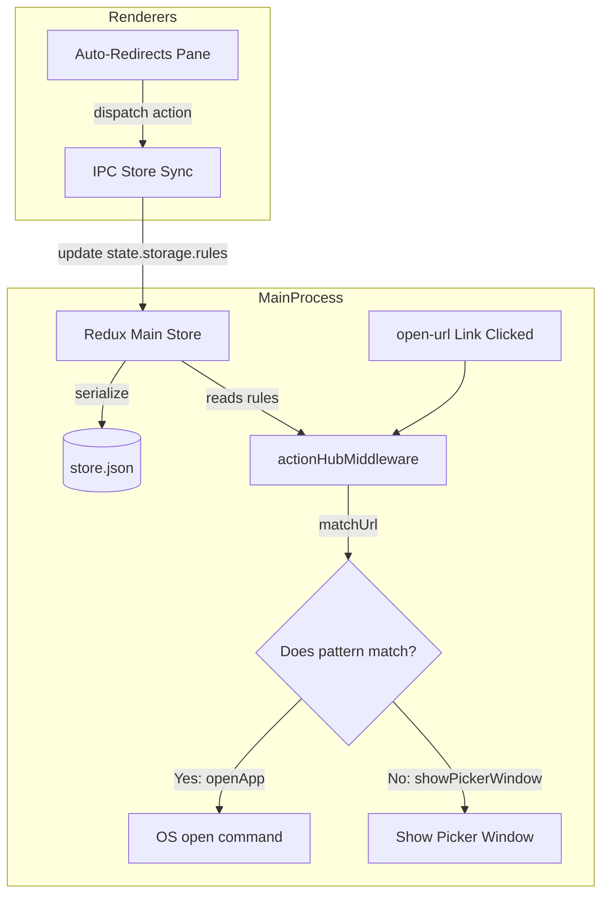

# BrowserDirect Rebranding & Auto-Redirect Rules Implementation Plan

> **For agentic workers:** REQUIRED SUB-SKILL: Use superpowers:subagent-driven-development to implement this plan task-by-task. Steps use checkbox (`- [ ]`) syntax for tracking.

**Goal:** Rebrand Browserosaurus to BrowserDirect and introduce an Auto-Redirects Preferences pane to automatically open matched URLs in designated browsers.

**Architecture:** 
1. Rebrand existing metadata, labels, and window titles to BrowserDirect.
2. Define a new `rules` list in `state.storage` with `addedRedirectRule` and `removedRedirectRule` actions.
3. Write a URL wildcard matching engine `matchUrl(url, pattern)`.
4. Intercept the URL in `openedUrl` middleware in the main process; match it against the rules and automatically open in the target browser, bypassing the picker window.
5. Add a React pane in Preferences under the tab "Auto-Redirects" to add/delete patterns.

**Architecture Diagram:**



**Tech Stack:** Electron 33, React 18, Vite 5, Redux Toolkit, Jest, Tailwind CSS.

## Global Constraints
* The application name is BrowserDirect (package name: `browser-direct`).
* App Bundle ID is updated to `com.browserdirect`.
* URL matching style: Wildcard (`*`) and case-insensitive substring matching only.

---

### Task 1: Rebrand configuration and metadata

**Files:**
- Modify: `package.json`
- Modify: `forge.config.js`
- Modify: `src/main/windows.ts`
- Modify: `src/renderers/prefs/components/organisms/header-bar.tsx`

**Interfaces:**
- Produces: Renamed application bundle, product metadata, and UI labels.

- [ ] **Step 1: Modify project configurations and window titles**

Update `package.json` to change the name and productName:
```diff
 {
-  "name": "browserosaurus",
+  "name": "browser-direct",
   "version": "20.12.0",
-  "description": "The browser prompter for macOS",
+  "description": "The browser prompter and direct router for macOS",
-  "homepage": "https://wstone.io/browserosaurus",
+  "homepage": "https://github.com/local/browser-direct",
-  "productName": "Browserosaurus"
+  "productName": "BrowserDirect"
 }
```

Update `forge.config.js` to change the bundle ID:
```diff
     packagerConfig: {
       asar: true,
-      appBundleId: 'com.browserosaurus',
+      appBundleId: 'com.browserdirect',
```

Update `src/main/windows.ts` to change picker and preference window titles:
```diff
     title: 'Preferences',
...
     show: false,
-    title: 'Browserosaurus',
+    title: 'BrowserDirect',
```

Update `src/renderers/prefs/components/organisms/header-bar.tsx` to update the header title:
```diff
       <div className="flex h-8 items-center justify-center pb-8 pt-4 draggable">
-        Browserosaurus Preferences
+        BrowserDirect Preferences
       </div>
```

- [ ] **Step 2: Run verification commands**

Run: `npm run lint` and `npm run typecheck`
Expected: Zero compilation or syntax errors.

- [ ] **Step 3: Commit changes**

```bash
git add package.json forge.config.js src/main/windows.ts src/renderers/prefs/components/organisms/header-bar.tsx
git commit -m "chore: rebrand project to BrowserDirect"
```

---

### Task 2: State Definitions and Actions for Redirect Rules

**Files:**
- Modify: `src/shared/state/reducer.storage.ts`
- Modify: `src/shared/state/reducer.data.ts`
- Modify: `src/renderers/prefs/state/actions.ts`
- Create: `src/shared/state/reducer.storage.test.ts`

**Interfaces:**
- Produces:
  * `addedRedirectRule({ pattern: string; appName: AppName })` Redux action.
  * `removedRedirectRule({ id: string })` Redux action.
  * Extends the `Storage` type to include `rules: RedirectRule[]`.

- [ ] **Step 1: Create unit test file `src/shared/state/reducer.storage.test.ts`**

Create `src/shared/state/reducer.storage.test.ts` containing:
```typescript
import { storage, defaultStorage } from './reducer.storage.js'
import { addedRedirectRule, removedRedirectRule } from '../../renderers/prefs/state/actions.js'

describe('storage reducer - redirect rules', () => {
  test('should add a redirect rule with unique id', () => {
    const initialState = {
      ...defaultStorage,
      rules: []
    }
    const action = addedRedirectRule({ pattern: '*github.com*', appName: 'Safari' })
    const nextState = storage(initialState, action)
    expect(nextState.rules.length).toBe(1)
    expect(nextState.rules[0].pattern).toBe('*github.com*')
    expect(nextState.rules[0].appName).toBe('Safari')
    expect(nextState.rules[0].id).toBeDefined()
  })

  test('should remove a redirect rule by id', () => {
    const initialState = {
      ...defaultStorage,
      rules: [
        { id: 'rule-1', pattern: 'localhost', appName: 'Google Chrome' }
      ]
    }
    const action = removedRedirectRule({ id: 'rule-1' })
    const nextState = storage(initialState, action)
    expect(nextState.rules.length).toBe(0)
  })
})
```

- [ ] **Step 2: Run test to verify it fails**

Run: `npx jest src/shared/state/reducer.storage.test.ts`
Expected: FAIL due to missing actions.

- [ ] **Step 3: Define actions and update reducer implementation**

Add actions to `src/renderers/prefs/state/actions.ts`:
```diff
+const addedRedirectRule = prefs<{ pattern: string; appName: AppName }>(
+  'redirects/added',
+)
+const removedRedirectRule = prefs<{ id: string }>('redirects/removed')
 
 export {
+  addedRedirectRule,
+  removedRedirectRule,
```

Update types, default state, and reducer cases in `src/shared/state/reducer.storage.ts`:
```diff
+import type { AppName } from '../../config/apps.js'
 import {
   changedPickerWindowBounds,
   readiedApp,
   receivedRendererStartupSignal,
   retrievedInstalledApps,
 } from '../../main/state/actions.js'
 import {
   clickedDonate,
   clickedMaybeLater,
 } from '../../renderers/picker/state/actions.js'
 import {
+  addedRedirectRule,
   confirmedReset,
   reorderedApp,
+  removedRedirectRule,
   updatedHotCode,
 } from '../../renderers/prefs/state/actions.js'
 
+export type RedirectRule = {
+  id: string
+  pattern: string
+  appName: AppName
+}
+
 type Storage = {
   apps: {
     name: AppName
     hotCode: string | null
     isInstalled: boolean
   }[]
   supportMessage: number
   isSetup: boolean
   height: number
+  rules: RedirectRule[]
 }
 
 const defaultStorage: Storage = {
   apps: [],
   height: 200,
   isSetup: false,
   supportMessage: 0,
+  rules: [],
 }
```
Add reducer handlers:
```diff
     .addCase(reorderedApp, (state, action) => {
       const sourceIndex = state.apps.findIndex(
         (app) => app.name === action.payload.sourceName,
       )
 
       const destinationIndex = state.apps.findIndex(
         (app) => app.name === action.payload.destinationName,
       )
 
       const [removed] = state.apps.splice(sourceIndex, 1)
       state.apps.splice(destinationIndex, 0, removed)
     })
+    .addCase(addedRedirectRule, (state, action) => {
+      state.rules.push({
+        id: Date.now().toString() + Math.random().toString(36).substr(2, 9),
+        pattern: action.payload.pattern,
+        appName: action.payload.appName,
+      })
+    })
+    .addCase(removedRedirectRule, (state, action) => {
+      state.rules = state.rules.filter((rule) => rule.id !== action.payload.id)
+    }),
```

Update `PrefsTab` in `src/shared/state/reducer.data.ts` to allow redirects tab:
```diff
-type PrefsTab = 'about' | 'apps' | 'general'
+type PrefsTab = 'about' | 'apps' | 'general' | 'redirects'
```

- [ ] **Step 4: Run test to verify it passes**

Run: `npx jest src/shared/state/reducer.storage.test.ts`
Expected: PASS.

- [ ] **Step 5: Commit changes**

```bash
git add src/shared/state/reducer.storage.ts src/shared/state/reducer.data.ts src/renderers/prefs/state/actions.ts src/shared/state/reducer.storage.test.ts
git commit -m "feat: add storage state and actions for redirect rules"
```

---

### Task 3: URL Wildcard Matching Engine & Unit Tests

**Files:**
- Create: `src/main/utils/match-url.ts`
- Create: `src/main/utils/match-url.test.ts`

**Interfaces:**
- Produces: `matchUrl(url: string, pattern: string): boolean`

- [ ] **Step 1: Write tests in `src/main/utils/match-url.test.ts`**

Create `src/main/utils/match-url.test.ts` containing:
```typescript
import { matchUrl } from './match-url.js'

describe('matchUrl', () => {
  test('handles exact string match (case-insensitive)', () => {
    expect(matchUrl('https://github.com/will-stone', 'github.com')).toBe(true)
    expect(matchUrl('https://GITHUB.COM/will-stone', 'github.com')).toBe(true)
    expect(matchUrl('https://google.com', 'github.com')).toBe(false)
  })

  test('handles wildcard * matches', () => {
    expect(matchUrl('https://github.com/will-stone', '*github.com*')).toBe(true)
    expect(matchUrl('https://github.com', '*github.com')).toBe(true)
    expect(matchUrl('github.com/abc', 'github.com*')).toBe(true)
  })

  test('handles empty or invalid patterns gracefully', () => {
    expect(matchUrl('https://github.com', '')).toBe(false)
  })
})
```

- [ ] **Step 2: Run test to verify it fails**

Run: `npx jest src/main/utils/match-url.test.ts`
Expected: FAIL (file not found/implemented).

- [ ] **Step 3: Implement `matchUrl` function**

Create `src/main/utils/match-url.ts` containing:
```typescript
export function matchUrl(url: string, pattern: string): boolean {
  if (!pattern) return false

  const lowerUrl = url.toLowerCase()
  const lowerPattern = pattern.toLowerCase()

  if (lowerPattern.includes('*')) {
    // Escape all regex characters except '*'
    const escapedPattern = lowerPattern
      .replace(/[.+^${}()|[\]\\]/g, '\\$&')
      .replace(/\*/g, '.*')
    const regex = new RegExp(`^${escapedPattern}$`)
    return regex.test(lowerUrl)
  }

  return lowerUrl.includes(lowerPattern)
}
```

- [ ] **Step 4: Run test to verify it passes**

Run: `npx jest src/main/utils/match-url.test.ts`
Expected: PASS.

- [ ] **Step 5: Commit changes**

```bash
git add src/main/utils/match-url.ts src/main/utils/match-url.test.ts
git commit -m "feat: implement wildcard/substring url matching engine"
```

---

### Task 4: Main Process Routing & Interception

**Files:**
- Modify: `src/main/state/middleware.action-hub.ts`
- Create: `src/main/state/middleware.action-hub.test.ts`

**Interfaces:**
- Consumes: `matchUrl` from `src/main/utils/match-url.js`

- [ ] **Step 1: Write integration tests in `src/main/state/middleware.action-hub.test.ts`**

Create `src/main/state/middleware.action-hub.test.ts` containing:
```typescript
import { actionHubMiddleware } from './middleware.action-hub.js'
import { openedUrl } from './actions.js'
import * as openAppModule from '../utils/open-app.js'
import * as windowsModule from '../windows.js'

jest.mock('../utils/open-app.js')
jest.mock('../windows.js')

describe('actionHubMiddleware - URL Routing', () => {
  let mockDispatch: jest.Mock
  let mockGetState: jest.Mock
  let middleware: any

  beforeEach(() => {
    jest.clearAllMocks()
    mockDispatch = jest.fn()
    mockGetState = jest.fn()
    middleware = actionHubMiddleware()({ dispatch: mockDispatch, getState: mockGetState })
  })

  test('redirects matching URL immediately and does not show picker window', () => {
    mockGetState.mockReturnValue({
      storage: {
        rules: [{ id: '1', pattern: '*github.com*', appName: 'Safari' }],
        apps: [{ name: 'Safari', isInstalled: true }]
      },
      data: {}
    })

    const action = openedUrl('https://github.com/abc')
    const next = jest.fn()

    middleware(next)(action)

    expect(openAppModule.openApp).toHaveBeenCalledWith('Safari', 'https://github.com/abc', false, false)
    expect(windowsModule.showPickerWindow).not.toHaveBeenCalled()
  })

  test('falls back to showing picker window when no redirect pattern matches', () => {
    mockGetState.mockReturnValue({
      storage: {
        rules: [{ id: '1', pattern: '*github.com*', appName: 'Safari' }],
        apps: [{ name: 'Safari', isInstalled: true }]
      },
      data: {}
    })

    const action = openedUrl('https://google.com')
    const next = jest.fn()

    middleware(next)(action)

    expect(openAppModule.openApp).not.toHaveBeenCalled()
    expect(windowsModule.showPickerWindow).toHaveBeenCalled()
  })
})
```

- [ ] **Step 2: Run test to verify it fails**

Run: `npx jest src/main/state/middleware.action-hub.test.ts`
Expected: FAIL (does not intercept and openApp, shows window instead).

- [ ] **Step 3: Modify action hub middleware to perform direct routing**

Add imports and update the `openedUrl` case in `src/main/state/middleware.action-hub.ts`:
```diff
 import { database } from '../database.js'
 import { createTray } from '../tray.js'
 import copyUrlToClipboard from '../utils/copy-url-to-clipboard.js'
 import { getAppIcons } from '../utils/get-app-icons.js'
 import { getInstalledAppNames } from '../utils/get-installed-app-names.js'
 import { initUpdateChecker } from '../utils/init-update-checker.js'
+import { matchUrl } from '../utils/match-url.js'
 import { openApp } from '../utils/open-app.js'
```
```diff
-    // Open URL
-    else if (openedUrl.match(action)) {
-      showPickerWindow()
-    }
+    // Open URL
+    else if (openedUrl.match(action)) {
+      const url = action.payload
+      const rules = nextState.storage.rules || []
+      let redirected = false
+
+      for (const rule of rules) {
+        if (matchUrl(url, rule.pattern)) {
+          const targetApp = nextState.storage.apps.find(
+            (app) => app.name === rule.appName && app.isInstalled,
+          )
+          if (targetApp) {
+            openApp(rule.appName, url, false, false)
+            redirected = true
+            break
+          }
+        }
+      }
+
+      if (!redirected) {
+        showPickerWindow()
+      }
+    }
```

- [ ] **Step 4: Run test to verify it passes**

Run: `npx jest src/main/state/middleware.action-hub.test.ts`
Expected: PASS.

- [ ] **Step 5: Commit changes**

```bash
git add src/main/state/middleware.action-hub.ts src/main/state/middleware.action-hub.test.ts
git commit -m "feat: intercept URLs in main middleware for auto-redirection"
```

---

### Task 5: Auto-Redirect Preferences Pane & UI Integration

**Files:**
- Create: `src/renderers/prefs/components/organisms/pane-redirects.tsx`
- Create: `src/renderers/prefs/components/organisms/pane-redirects.test.tsx`
- Modify: `src/renderers/prefs/components/organisms/header-bar.tsx`
- Modify: `src/renderers/prefs/components/layout.tsx`

**Interfaces:**
- Consumes: `addedRedirectRule`, `removedRedirectRule` actions, and Redux storage state.

- [ ] **Step 1: Write UI tests for `<RedirectsPane />`**

Create `src/renderers/prefs/components/organisms/pane-redirects.test.tsx` containing:
```typescript
import { render, screen, fireEvent } from '@testing-library/react'
import { Provider } from 'react-redux'
import { configureStore } from '@reduxjs/toolkit'
import { rootReducer } from '../../../../shared/state/reducer.root.js'
import { RedirectsPane } from './pane-redirects.js'

describe('RedirectsPane', () => {
  let store: any

  beforeEach(() => {
    store = configureStore({
      reducer: rootReducer,
      preloadedState: {
        data: {
          prefsTab: 'redirects',
          icons: {}
        },
        storage: {
          apps: [
            { name: 'Safari', isInstalled: true, hotCode: null },
            { name: 'Google Chrome', isInstalled: true, hotCode: null }
          ],
          rules: [
            { id: '1', pattern: '*github.com*', appName: 'Safari' }
          ]
        }
      } as any
    })
  })

  test('renders existing redirect rules', () => {
    render(
      <Provider store={store}>
        <RedirectsPane />
      </Provider>
    )

    expect(screen.getByText('*github.com*')).toBeInTheDocument()
    expect(screen.getByText('Safari')).toBeInTheDocument()
  })

  test('allows adding new redirect rule', () => {
    render(
      <Provider store={store}>
        <RedirectsPane />
      </Provider>
    )

    const input = screen.getByPlaceholderText('e.g., *google.com*')
    const button = screen.getByText('Add Rule')

    fireEvent.change(input, { target: { value: '*localhost*' } })
    fireEvent.click(button)

    const state = store.getState()
    expect(state.storage.rules.some((r: any) => r.pattern === '*localhost*')).toBe(true)
  })
})
```

- [ ] **Step 2: Run test to verify it fails**

Run: `npx jest src/renderers/prefs/components/organisms/pane-redirects.test.tsx`
Expected: FAIL (file not found/implemented).

- [ ] **Step 3: Implement Auto-Redirects Preferences Pane UI**

Create `src/renderers/prefs/components/organisms/pane-redirects.tsx` containing:
```typescript
import React, { useState } from 'react'
import { useDispatch } from 'react-redux'
import { useSelector, useInstalledApps, useDeepEqualSelector } from '../../../shared/state/hooks.js'
import { addedRedirectRule, removedRedirectRule } from '../../state/actions.js'
import { Pane } from '../molecules/pane.js'
import Button from '../../../shared/components/atoms/button.js'
import type { AppName } from '../../../../config/apps.js'

export const RedirectsPane = (): JSX.Element => {
  const dispatch = useDispatch()
  const rules = useDeepEqualSelector((state) => state.storage.rules || [])
  const installedApps = useInstalledApps()
  const icons = useDeepEqualSelector((state) => state.data.icons)

  const [pattern, setPattern] = useState('')
  const [selectedApp, setSelectedApp] = useState<AppName>(
    installedApps[0]?.name || 'Safari'
  )

  const handleAdd = (e: React.FormEvent) => {
    e.preventDefault()
    if (!pattern.trim()) return

    dispatch(
      addedRedirectRule({
        pattern: pattern.trim(),
        appName: selectedApp,
      })
    )
    setPattern('')
  }

  return (
    <Pane className="space-y-6" pane="redirects">
      <div className="flex-1 overflow-y-auto pr-1 space-y-3 min-h-[180px]">
        {rules.length === 0 ? (
          <div className="text-center py-8 text-sm opacity-50">
            No auto-redirect rules configured. Matches will ask which browser to use.
          </div>
        ) : (
          rules.map((rule) => (
            <div
              key={rule.id}
              className="flex items-center justify-between p-3 rounded-xl bg-black/5 dark:bg-white/5 border border-black/10 dark:border-white/10"
            >
              <div className="flex items-center space-x-3">
                <span className="font-mono text-sm px-2 py-0.5 rounded bg-black/10 dark:bg-white/10">
                  {rule.pattern}
                </span>
                <span className="opacity-45">&rarr;</span>
                <div className="flex items-center space-x-2">
                  {icons[rule.appName] && (
                    
                  )}
                  <span className="text-sm">{rule.appName}</span>
                </div>
              </div>
              <Button
                className="hover:text-red-500 focus:text-red-500 font-bold"
                onClick={() => dispatch(removedRedirectRule({ id: rule.id }))}
              >
                Delete
              </Button>
            </div>
          ))
        )}
      </div>

      <form
        onSubmit={handleAdd}
        className="pt-4 border-t border-black/10 dark:border-white/10 space-y-4"
      >
        <h3 className="text-sm font-semibold">Add Redirect Rule</h3>
        <div className="flex items-center space-x-3">
          <input
            type="text"
            className="flex-1 px-3 py-1.5 rounded-lg border border-black/20 dark:border-white/20 bg-white dark:bg-[#56555C] text-sm focus:outline-none focus:ring-2 focus:ring-blue-500 dark:text-white"
            placeholder="e.g., *google.com*"
            value={pattern}
            onChange={(e) => setPattern(e.target.value)}
            required
          />
          <select
            className="px-3 py-1.5 rounded-lg border border-black/20 dark:border-white/20 bg-white dark:bg-[#56555C] text-sm focus:outline-none focus:ring-2 focus:ring-blue-500 dark:text-white"
            value={selectedApp}
            onChange={(e) => setSelectedApp(e.target.value as AppName)}
          >
            {installedApps.map((app) => (
              <option key={app.name} value={app.name}>
                {app.name}
              </option>
            ))}
          </select>
          <Button
            type="submit"
            className="bg-blue-600 hover:bg-blue-700 text-white font-semibold"
          >
            Add Rule
          </Button>
        </div>
      </form>
    </Pane>
  )
}
```

Modify `src/renderers/prefs/components/organisms/header-bar.tsx` to include the tab button:
```diff
       <div className="flex items-center justify-center space-x-12">
         <TabButton tab="general">General</TabButton>
         <TabButton tab="apps">Apps</TabButton>
+        <TabButton tab="redirects">Auto-Redirects</TabButton>
         <TabButton tab="about">About</TabButton>
       </div>
```

Modify `src/renderers/prefs/components/layout.tsx` to mount the new pane:
```diff
 import { AboutPane } from './organisms/pane-about.js'
 import { AppsPane } from './organisms/pane-apps.js'
 import { GeneralPane } from './organisms/pane-general.js'
+import { RedirectsPane } from './organisms/pane-redirects.js'
 
 const useAppStarted = () => {
...
       <div className="flex grow flex-col overflow-hidden p-8">
         <GeneralPane />
         <AppsPane />
+        <RedirectsPane />
         <AboutPane />
       </div>
```

- [ ] **Step 4: Run test to verify it passes**

Run: `npx jest src/renderers/prefs/components/organisms/pane-redirects.test.tsx`
Expected: PASS.

- [ ] **Step 5: Commit changes**

```bash
git add src/renderers/prefs/components/organisms/pane-redirects.tsx src/renderers/prefs/components/organisms/pane-redirects.test.tsx src/renderers/prefs/components/organisms/header-bar.tsx src/renderers/prefs/components/layout.tsx
git commit -m "feat: implement Auto-Redirects Preference pane UI and integration"
```
